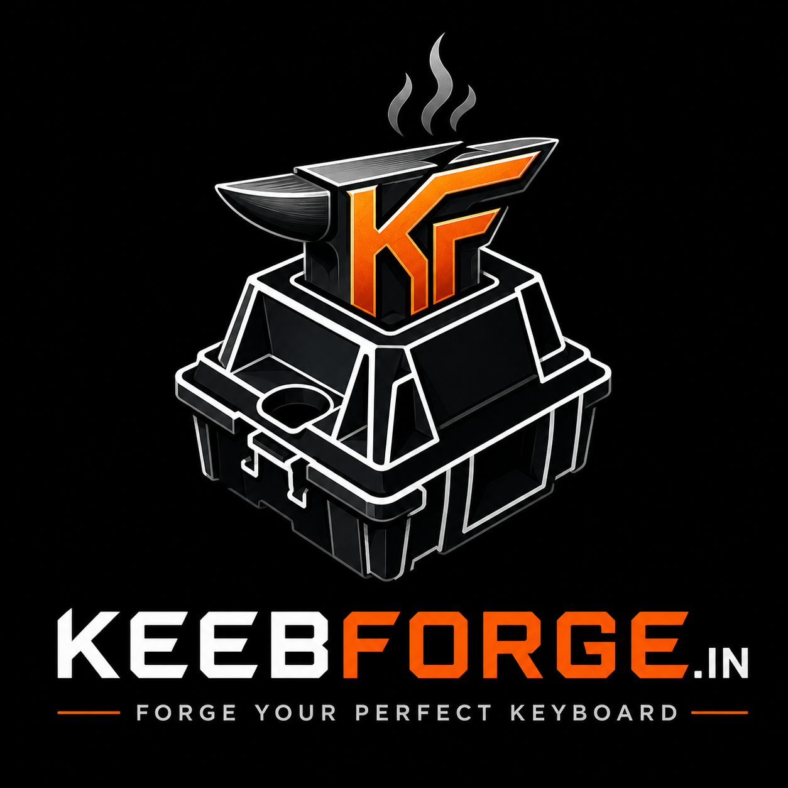
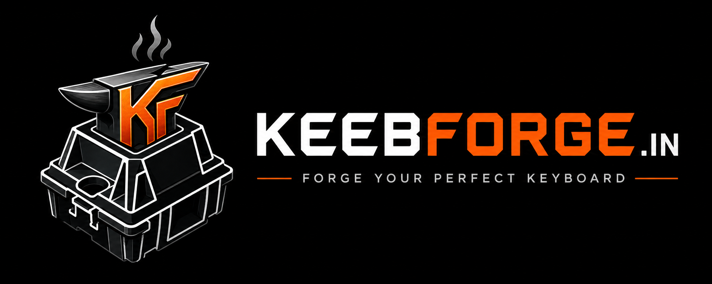

<table style="border: none; border-collapse: collapse;">
  <tr>
    <td width="110" style="border: none; padding: 0;">
      
    </td>
    <td style="border: none; padding: 0 0 0 16px;">
      <h1>⌨ KeebForge.in</h1>
      <b>Independent Electronics Workshop for Custom Mechanical Keyboards And Accessory</b>
       Precision switch modifications, custom keyboard builds, PCB design, firmware, soldering, electronics repair, tech accessory and an integrated pricing & order management experience.  
      <a href="https://keebforge.in/">🌐 Keebforge.in</a> &nbsp;·&nbsp;
      <a href="https://keebforge.in/order/">🐛 Place Order</a> &nbsp;·&nbsp;
      <a href="https://keebforge.in/Terms&Conditions/">🍴Terms & Conditions </a> &nbsp;·&nbsp;
      <a href="https://keebforge.in/About/">🚀 About Me</a>
    </td>
  </tr>
</table>

# Current Services

## Switch Services

- Krytox 205g0 Lubing
- Stem Tuning
- Durock Films
- TX Films
- Spring Swap
- Complete Switch Mod

## Stabilizer Services

- Full Stabilizer Service
- Wire Balancing
- Stabilizer Restoration

## Build Services

- Switch Soldering
- Switch Desoldering
- Keyboard Assembly
- Mill-Max Installation
- Hotswap Socket Installation
- Split Keyboard Build
  
## PCB & Engineering

- PCB Design
- PCB Fabrication Support
- Firmware Flashing
- PCB Diagnostics

## Mouse Services

- Switch Replacement
- Encoder Replacement
- Tape Mod
- Skate Replacement
- General Repairs

## Electronics Repair

- Component-level diagnostics
- PCB repair
- Microcontroller repair
- Hobby electronics
- Consumer electronics

---

# Community Projects

## Mochi40

An open-source 40% custom mechanical keyboard project featuring:

- Elite-C footprint
- nice!nano support
- OLED support
- EC11 rotary encoder
- Hotswap sockets
- Open-source PCB
- Manufacturing cost calculator
- Interest Check tracking

---

# Deployment

Since the project is fully static, it can be hosted on:

- GitHub Pages
- Cloudflare Pages
- Netlify
- Vercel
- Firebase Hosting
- Any static web server

---
# Future Roadmap

- [ ] Online payment integration
- [ ] Customer dashboard
- [ ] Order tracking
- [ ] Inventory management
- [ ] Review submission system
- [ ] Admin panel
- [ ] Dynamic project showcase
- [ ] Multi-language support
- [ ] Dark/Light theme toggle
- [ ] Email notifications

---

    
  

